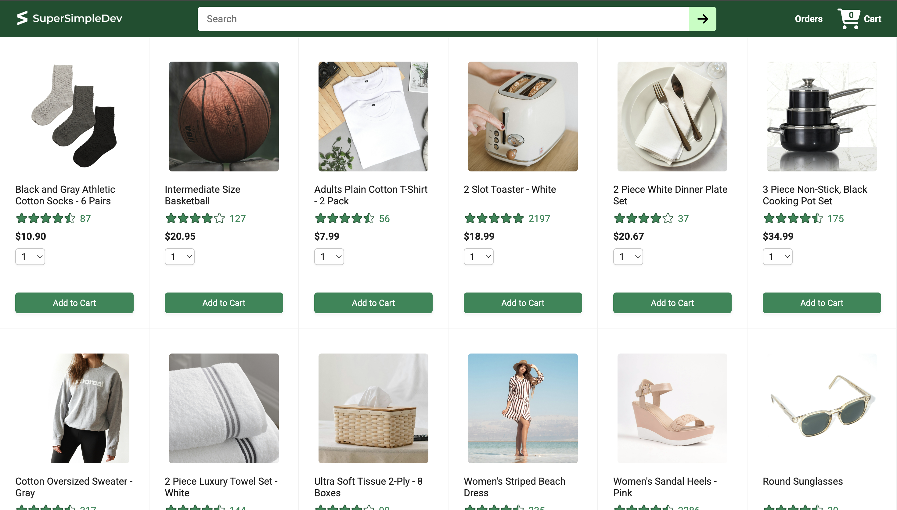
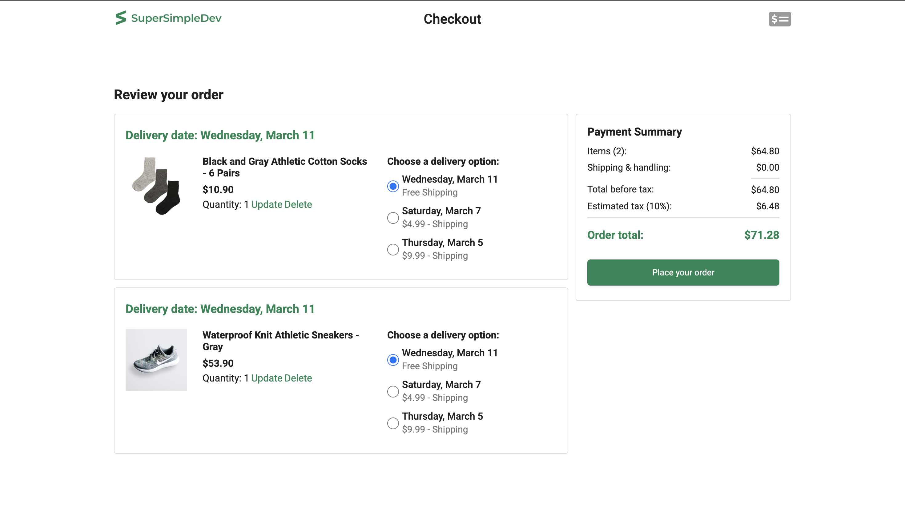
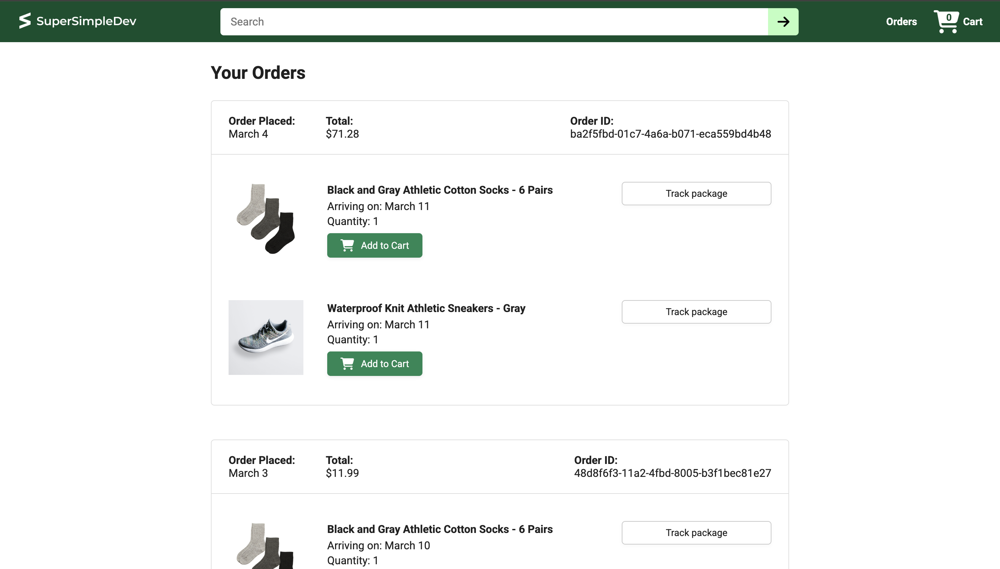

# React E-Commerce Project


A **React-based e-commerce application** built using **React, Vite, JavaScript, and TypeScript**.  
The project replicates a simplified online shopping experience including product browsing, cart management, checkout flow, order tracking, and navigation across multiple pages.

The application consists of a **React frontend** that communicates with a **locally running backend API**. Both services must be running locally for the application to function properly.

---

## Tech Stack

Frontend:

- **React**
- **JavaScript**
- **TypeScript**
- **Vite**
- **CSS**
- **React Router**

Backend (used locally by the frontend):

- **Node.js**
- **Express**

---

## Features

- Product listing page
- Add products to cart
- Dynamic cart updates
- Checkout page with **order summary** and **payment summary**
- Orders page displaying placed orders
- Tracking page for order tracking
- Navigation between pages using **React Router**
- Communication with a locally running backend API for product and order data

---

## Project Structure

```
ecommerce-project/
│
├── ecommerce-backend/
│   └── ...
│
└── ecommerce-project/
    │
    ├── src/
    │   ├── components/
    │   ├── pages/
    │   │   ├── home/
    │   │   ├── checkout/
    │   │   ├── orders/
    │   │   └── tracking/
    │   ├── utils/
    │   └── assets/
    │
    ├── screenshots/
    │   ├── main-page.png
    │   ├── checkout-page.png
    │   └── orders-page.png
    │
    ├── public/
    ├── index.html
    └── vite.config.ts
```

---

## Running the Project Locally

Both the **backend and frontend must be running** for the application to work.

### 1. Clone the Repository

```bash
git clone https://github.com/mabhishek-dev/ecommerce-project.git
cd ecommerce-project
```

---

### 2. Start the Backend

Open a terminal and run:

```bash
cd ecommerce-backend
npm install
npm run dev
```

The backend API must be running before starting the frontend.

---

### 3. Start the Frontend

Open a **second terminal** and run:

```bash
cd ecommerce-project
npm install
npm run dev
```

The frontend will connect to the locally running backend API.

After the server starts, open the **local development URL shown in the terminal** (typically `http://localhost:5173`) in your browser.

---

## Screenshots

### Main Page


### Checkout Page


### Orders Page


---

## License

This project is licensed under the **MIT License**.
